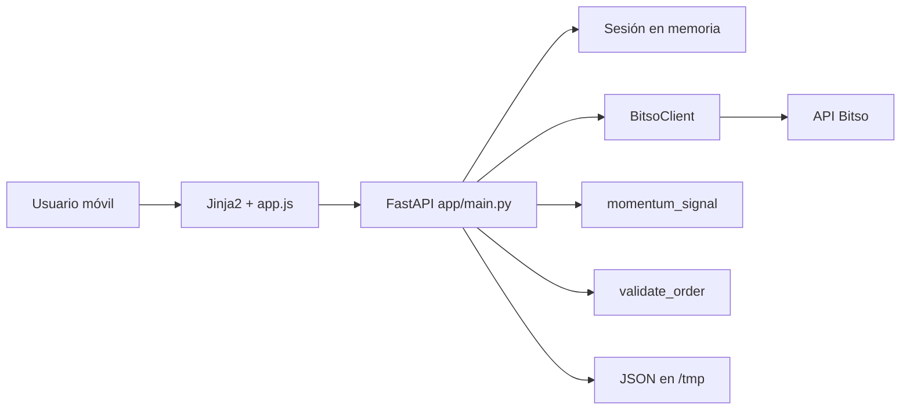
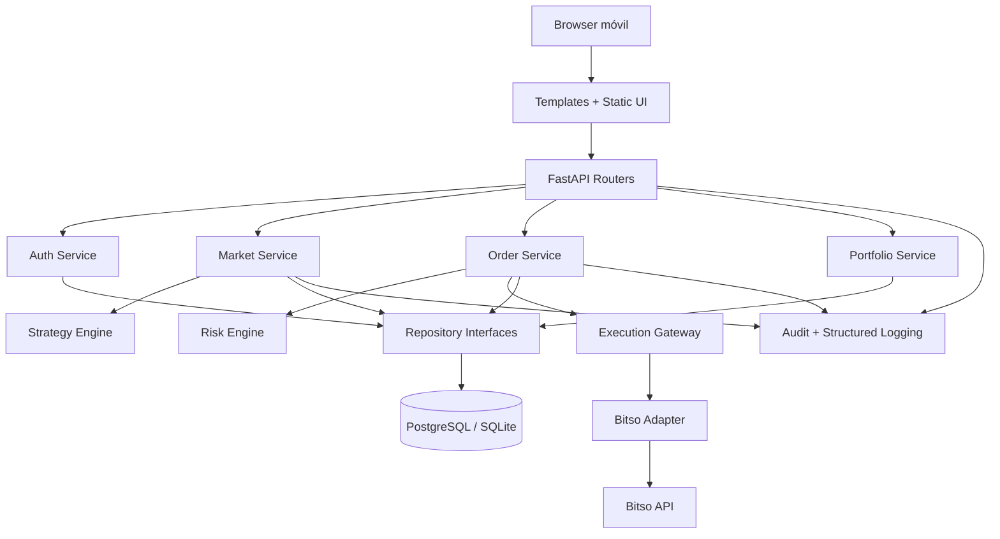
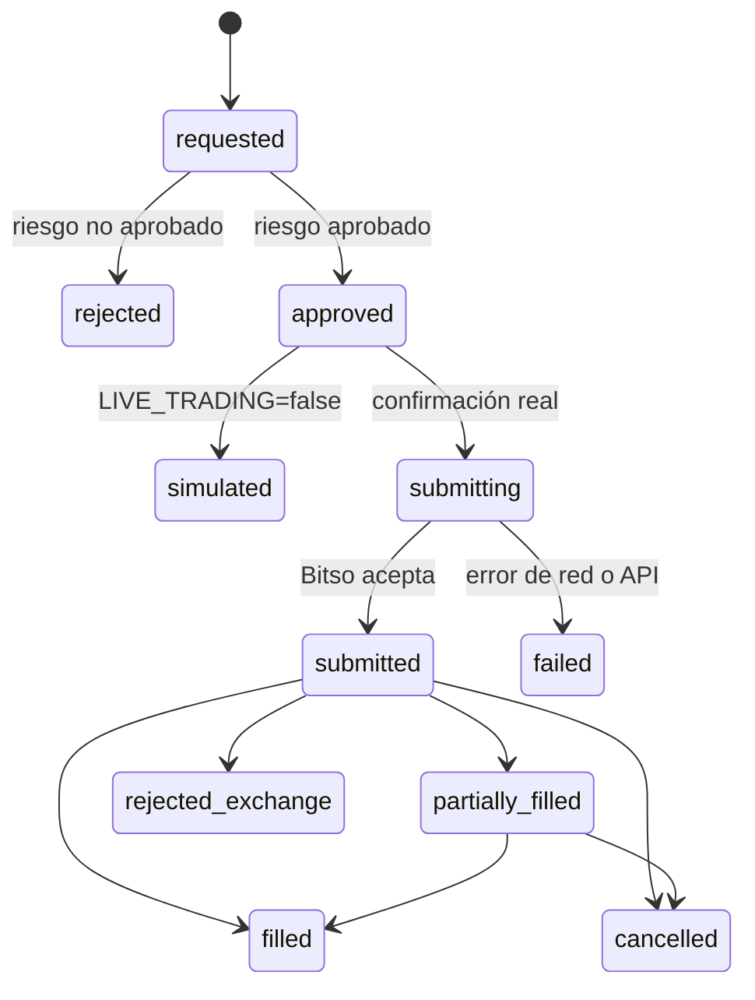

# Paul AI Trader v2 — Arquitectura del dashboard

> Rama de trabajo: `v2-dashboard`  
> Estado del documento: arquitectura base para la evolución de v1 a v2  
> Principio de seguridad: `LIVE_TRADING=false` permanece como valor predeterminado.

## 1. Propósito

Este documento describe:

1. La estructura actual de Paul AI Trader v1.
2. Las responsabilidades y flujos que ya existen.
3. Los riesgos técnicos actuales.
4. La arquitectura objetivo para Paul AI Trader v2.
5. El orden recomendado de implementación dentro de la rama `v2-dashboard`.

La v2 debe evolucionar como un **monolito modular**. No se requieren microservicios para el tamaño actual del proyecto. La prioridad es separar responsabilidades, conservar controles de seguridad, añadir persistencia confiable y permitir un dashboard más completo sin complicar innecesariamente la operación en Render.

---

## 2. Estado actual de la rama

Al crear este documento, `v2-dashboard` parte del mismo commit que `main`. El código funcional corresponde a Paul AI Trader v1 y está desplegado como una aplicación FastAPI.

### 2.1 Estructura actual

```text
.
├── README.md
├── render.yaml
├── requirements.txt
├── app/
│   ├── __init__.py
│   ├── config.py
│   ├── main.py
│   ├── models.py
│   ├── services/
│   │   ├── __init__.py
│   │   ├── bitso.py
│   │   ├── risk.py
│   │   ├── store.py
│   │   └── strategy.py
│   ├── static/
│   │   ├── app.css
│   │   └── app.js
│   └── templates/
│       └── index.html
└── tests/
    └── test_risk.py
```

### 2.2 Responsabilidades actuales

| Archivo | Responsabilidad actual |
|---|---|
| `app/main.py` | Inicializa FastAPI, sirve el dashboard, administra autenticación, expone endpoints, consulta Bitso, valida riesgo y registra simulaciones. |
| `app/config.py` | Carga configuración y secretos desde variables de entorno. |
| `app/models.py` | Define modelos Pydantic para login, órdenes y señales. |
| `app/services/bitso.py` | Firma solicitudes privadas HMAC y consume la API de Bitso. |
| `app/services/risk.py` | Aplica límites deterministas por mercado, monto, pérdida diaria y órdenes abiertas. |
| `app/services/store.py` | Guarda hasta 100 simulaciones en un archivo JSON dentro de `/tmp`. |
| `app/services/strategy.py` | Genera una señal básica usando la posición del precio dentro del rango de 24 horas. |
| `app/templates/index.html` | Renderiza la interfaz móvil con Jinja2. |
| `app/static/app.js` | Maneja login, consulta de mercado, envío de órdenes y carga del historial. |
| `app/static/app.css` | Define el diseño visual responsivo. |
| `render.yaml` | Configura build, arranque, health check y variables no secretas en Render. |
| `tests/test_risk.py` | Cubre tres escenarios básicos del motor de riesgo. |

---

## 3. Flujo actual



### 3.1 Consulta de mercado

1. El navegador solicita `/api/market/{book}`.
2. FastAPI verifica la cookie de sesión.
3. Se valida que el mercado esté permitido.
4. `BitsoClient` consulta el ticker público.
5. `momentum_signal` genera `buy`, `sell` o `hold`.
6. La API devuelve ticker, señal y advertencia educativa.

### 3.2 Orden simulada

1. El navegador envía `/api/orders`.
2. El cuerpo incluye mercado, lado, monto, P&L diario y número de órdenes abiertas.
3. `validate_order` determina si la orden está dentro de los límites.
4. Con `LIVE_TRADING=false`, la operación se registra en `/tmp`.
5. El historial se devuelve mediante `/api/simulations`.

### 3.3 Orden real

1. Solamente se alcanza este flujo con `LIVE_TRADING=true`.
2. El motor de riesgo debe aprobar la orden.
3. La v1 permite únicamente compras de mercado por monto MXN.
4. Las ventas reales permanecen bloqueadas.
5. `BitsoClient` firma y envía la orden a Bitso.

---

## 4. Hallazgos y limitaciones de v1

### 4.1 Autenticación y sesiones

- La sesión válida se genera al arrancar el proceso y vive solamente en memoria.
- Reiniciar o redeplegar la aplicación invalida todas las sesiones.
- Varias instancias de la aplicación no compartirían la misma sesión.
- `SESSION_SECRET` está definido en configuración, pero todavía no se utiliza para firmar sesiones.
- La cookie se marca siempre como `secure`; esto es correcto en Render con HTTPS, pero dificulta el login local mediante HTTP.
- No hay protección CSRF para operaciones de escritura.
- No existe límite de intentos de login.

### 4.2 Persistencia

- Las simulaciones se escriben en `/tmp/paul_ai_trader_simulations.json`.
- El contenido de `/tmp` es efímero y puede perderse en reinicios o despliegues.
- No hay migraciones, modelo de datos ni trazabilidad histórica durable.
- No existe separación entre órdenes simuladas, órdenes reales, decisiones de riesgo y eventos de auditoría.

### 4.3 Riesgo y ejecución

- `daily_pnl_mxn` y `open_orders` llegan desde el navegador; actualmente el frontend envía ambos como cero.
- Un cliente podría alterar esos valores. En v2 deben calcularse exclusivamente en el servidor.
- Los montos financieros se manejan con `float`; para dinero y cantidades de activos se debe usar `Decimal`.
- No existe idempotencia para evitar el envío duplicado de una orden real.
- No hay máquina de estados formal para órdenes.
- No hay reconciliación posterior entre la orden local y el estado reportado por Bitso.
- La orden de venta real no está implementada, lo cual es una restricción de seguridad adecuada mientras no exista cálculo de cantidad del activo.

### 4.4 Estrategia y datos

- La señal usa solamente ticker de 24 horas.
- No hay velas históricas, indicadores persistidos, backtesting ni evaluación de desempeño.
- La confianza mostrada es una regla heurística, no una probabilidad calibrada.
- No existe versionado de estrategia ni registro de los datos exactos usados para una decisión.

### 4.5 API y aplicación

- `app/main.py` concentra composición, autenticación, rutas y lógica de aplicación.
- No hay separación entre rutas, casos de uso, dominio e infraestructura.
- Los errores no siguen todavía un contrato uniforme.
- No hay logging estructurado, identificador de solicitud ni métricas operativas.
- `SignalResponse` está definido, pero los endpoints no declaran modelos de respuesta.

### 4.6 Desarrollo y pruebas

- Solo existen tres pruebas unitarias del motor de riesgo.
- No hay pruebas de API, autenticación, Bitso, persistencia ni frontend.
- `pytest` no aparece en las dependencias actuales.
- El README indica copiar `.env.example`, pero ese archivo no existe actualmente.

---

## 5. Decisiones de arquitectura para v2

### ADR-001 — Monolito modular

La v2 continuará como una sola aplicación desplegable en Render, organizada internamente por módulos y capas.

**Motivo:** reduce costo operativo, facilita el despliegue y mantiene suficiente separación para crecer sin introducir microservicios prematuramente.

### ADR-002 — FastAPI como backend

FastAPI seguirá siendo el punto de entrada HTTP y conservará I/O asíncrono para la integración con Bitso.

### ADR-003 — Dashboard server-rendered con JavaScript progresivo

La primera etapa de v2 mantendrá Jinja2 y JavaScript sin framework. El dashboard podrá reorganizarse por componentes visuales sin introducir todavía React, Vue u otro build frontend.

**Motivo:** el proyecto es pequeño, está optimizado para celular y no necesita una segunda cadena de build en esta etapa.

### ADR-004 — Persistencia SQL durable

- Producción: PostgreSQL administrado.
- Desarrollo local y pruebas: SQLite cuando resulte conveniente.
- Acceso a datos mediante repositorios con interfaces claras.
- Migraciones versionadas con Alembic.

### ADR-005 — Seguridad antes que automatización

- `LIVE_TRADING=false` seguirá siendo el estado predeterminado.
- Las funcionalidades del dashboard no requerirán permisos de retiro.
- El modo real deberá habilitarse mediante configuración explícita y controles adicionales.
- Los datos usados por riesgo se calcularán en el servidor.

### ADR-006 — Auditoría de decisiones

Cada señal, validación de riesgo y orden debe poder reconstruirse con:

- fecha y hora UTC;
- versión de estrategia;
- mercado;
- datos de entrada;
- resultado de la señal;
- límites de riesgo aplicados;
- decisión final;
- identificador de correlación;
- respuesta o estado de Bitso cuando aplique.

---

## 6. Arquitectura objetivo



### 6.1 Capas

#### Presentación

- Rutas HTTP.
- Modelos de solicitud y respuesta.
- Templates.
- JavaScript y CSS.
- Manejo uniforme de errores.

#### Aplicación

- Casos de uso de autenticación.
- Consulta y actualización de mercado.
- Cálculo de señales.
- Creación de órdenes simuladas.
- Validación y ejecución controlada de órdenes.
- Consulta de portafolio e historial.

#### Dominio

- Entidades y estados de órdenes.
- Valores monetarios y cantidades con `Decimal`.
- Decisiones de riesgo.
- Señales y versiones de estrategia.
- Reglas que no dependen de FastAPI, Bitso o la base de datos.

#### Infraestructura

- Cliente Bitso.
- Base de datos.
- Repositorios concretos.
- Configuración.
- Logging y observabilidad.
- Reloj, generación de identificadores y servicios externos.

---

## 7. Estructura propuesta

```text
.
├── README.md
├── render.yaml
├── requirements.txt
├── .env.example
├── alembic.ini
├── docs/
│   └── ARCHITECTURE_V2.md
├── migrations/
├── app/
│   ├── __init__.py
│   ├── main.py
│   ├── core/
│   │   ├── config.py
│   │   ├── security.py
│   │   ├── logging.py
│   │   └── errors.py
│   ├── api/
│   │   ├── dependencies.py
│   │   ├── schemas/
│   │   │   ├── auth.py
│   │   │   ├── market.py
│   │   │   ├── orders.py
│   │   │   └── portfolio.py
│   │   └── routes/
│   │       ├── auth.py
│   │       ├── dashboard.py
│   │       ├── market.py
│   │       ├── orders.py
│   │       └── portfolio.py
│   ├── domain/
│   │   ├── money.py
│   │   ├── orders.py
│   │   ├── risk.py
│   │   └── signals.py
│   ├── services/
│   │   ├── auth_service.py
│   │   ├── market_service.py
│   │   ├── order_service.py
│   │   ├── portfolio_service.py
│   │   ├── risk_engine.py
│   │   └── strategy_engine.py
│   ├── integrations/
│   │   └── bitso/
│   │       ├── client.py
│   │       ├── auth.py
│   │       └── schemas.py
│   ├── repositories/
│   │   ├── interfaces.py
│   │   └── sqlalchemy.py
│   ├── db/
│   │   ├── base.py
│   │   ├── models.py
│   │   └── session.py
│   ├── templates/
│   │   ├── base.html
│   │   ├── login.html
│   │   └── dashboard.html
│   └── static/
│       ├── css/
│       └── js/
└── tests/
    ├── unit/
    ├── integration/
    ├── api/
    └── fixtures/
```

Esta estructura es una dirección objetivo. Debe implementarse gradualmente; no es necesario crear carpetas vacías ni mover todo en un solo commit.

---

## 8. Modelo de datos inicial

### `simulated_orders`

- `id`
- `created_at`
- `book`
- `side`
- `amount_mxn`
- `reference_price`
- `status`
- `strategy_version`
- `signal_id`
- `risk_decision_id`
- `correlation_id`

### `signals`

- `id`
- `created_at`
- `book`
- `action`
- `confidence`
- `reason`
- `reference_price`
- `input_snapshot`
- `strategy_name`
- `strategy_version`

### `risk_decisions`

- `id`
- `created_at`
- `allowed`
- `reason`
- `limits_snapshot`
- `portfolio_snapshot`
- `order_request_snapshot`
- `correlation_id`

### `live_orders`

- `id`
- `origin_id`
- `bitso_order_id`
- `created_at`
- `updated_at`
- `book`
- `side`
- `order_type`
- `amount_mxn`
- `major_amount`
- `status`
- `raw_response`
- `idempotency_key`

### `portfolio_snapshots`

- `id`
- `created_at`
- `balances`
- `open_orders`
- `daily_realized_pnl_mxn`
- `daily_unrealized_pnl_mxn`

### `audit_events`

- `id`
- `created_at`
- `event_type`
- `actor`
- `correlation_id`
- `payload`

---

## 9. Contratos API objetivo

### Existentes que deben conservar compatibilidad inicialmente

- `GET /health`
- `GET /`
- `POST /api/login`
- `POST /api/logout`
- `GET /api/config`
- `GET /api/market/{book}`
- `GET /api/balance`
- `GET /api/simulations`
- `POST /api/orders`

### Nuevos o evolucionados

- `GET /api/v2/dashboard/summary`
- `GET /api/v2/markets/{book}/snapshot`
- `GET /api/v2/signals`
- `GET /api/v2/orders`
- `POST /api/v2/orders/simulated`
- `POST /api/v2/orders/live/preview`
- `POST /api/v2/orders/live/confirm`
- `GET /api/v2/portfolio`
- `GET /api/v2/risk/status`
- `GET /api/v2/audit/events`

El flujo real debe separar **preview** de **confirmación**. Ninguna solicitud de frontend debe decidir por sí misma el P&L diario, número de órdenes abiertas o disponibilidad de fondos.

---

## 10. Máquina de estados de órdenes



Cada transición debe persistirse y producir un evento de auditoría.

---

## 11. Controles obligatorios para trading real

Antes de habilitar cualquier operación real, la v2 debe cumplir como mínimo:

1. `LIVE_TRADING` desactivado por defecto.
2. Credenciales sin permiso de retiro.
3. Allowlist de mercados en servidor.
4. Límite por orden calculado en servidor.
5. Límite diario de pérdida calculado desde datos persistidos y/o reconciliados.
6. Número de órdenes abiertas consultado desde Bitso.
7. Validación de saldo antes de ejecutar.
8. Identificador idempotente por intento.
9. Confirmación explícita de la orden real.
10. Registro durable de solicitud, riesgo, respuesta y estado.
11. Timeout, manejo de reintentos y reconciliación sin duplicar órdenes.
12. Interruptor de emergencia para bloquear nuevas órdenes.
13. Pruebas automatizadas de regresión de todos los límites.

---

## 12. Autenticación propuesta

Para la primera versión del dashboard puede mantenerse un único operador, pero la sesión debe cambiar a una implementación firmada y compartible:

- `SessionMiddleware` o mecanismo equivalente usando `SESSION_SECRET`.
- Cookie `HttpOnly`, `SameSite=Lax` o más restrictiva según el flujo.
- `Secure=true` en producción y configurable para desarrollo local.
- Expiración definida.
- Rotación de sesión después de login.
- Protección CSRF para endpoints de escritura.
- Límite de intentos de login.
- Comparación constante de secretos.
- Nunca registrar contraseñas, API keys, secrets o encabezados de autorización.

---

## 13. Observabilidad

La v2 debe registrar eventos estructurados en JSON con:

- timestamp UTC;
- nivel;
- evento;
- ruta;
- código HTTP;
- duración;
- `correlation_id`;
- mercado y `origin_id` cuando aplique;
- resultado de riesgo;
- modo `SIMULATION` o `LIVE`.

No deben incluirse credenciales, firmas HMAC, cookies, contraseñas ni respuestas privadas completas que contengan información sensible.

El health check puede evolucionar a:

- `/health/live`: el proceso está activo.
- `/health/ready`: configuración y dependencias mínimas disponibles.

---

## 14. Estrategia de pruebas

### Unitarias

- Reglas de riesgo.
- Estados de órdenes.
- Cálculos con `Decimal`.
- Estrategias y señales.
- Validación de configuración.

### Integración

- Repositorios SQL.
- Migraciones.
- Cliente Bitso con transporte simulado.
- Firma HMAC con vectores conocidos.
- Reconciliación de órdenes.

### API

- Login y logout.
- Sesión expirada.
- Acceso no autorizado.
- Consulta de mercado.
- Orden simulada.
- Bloqueos de riesgo.
- Contratos y códigos de error.

### Seguridad y regresión

- Verificar que `LIVE_TRADING=false` nunca llame al endpoint de órdenes de Bitso.
- Verificar que los valores críticos de riesgo no puedan controlarse desde el navegador.
- Verificar que una repetición con la misma clave idempotente no duplique una orden.
- Verificar que ventas reales sigan bloqueadas hasta que exista cálculo correcto de cantidad y saldo.

---

## 15. Plan incremental recomendado

### Fase 1 — Base segura y documentación

- Crear este documento.
- Añadir `.env.example` sin secretos.
- Añadir dependencias de desarrollo y configuración de pruebas.
- Incorporar logging estructurado y configuración por entorno.
- Mantener endpoints actuales sin cambios visibles.

### Fase 2 — Persistencia

- Añadir SQLAlchemy y Alembic.
- Migrar simulaciones desde el store temporal a una tabla durable.
- Crear repositorios y pruebas de integración.
- Añadir historial paginado.

### Fase 3 — Modularización

- Separar routers de `app/main.py`.
- Separar servicios de aplicación y dominio.
- Mover Bitso a `integrations/bitso`.
- Definir contratos de respuesta y errores uniformes.

### Fase 4 — Dashboard v2

- Resumen de portafolio.
- Estado de conexión.
- Señales recientes.
- Historial de simulaciones.
- Estado de límites de riesgo.
- Diseño móvil con componentes reutilizables.
- Actualización controlada de datos sin recargar toda la página.

### Fase 5 — Preparación para trading real

- Preview y confirmación separadas.
- Idempotencia.
- Reconciliación con Bitso.
- P&L calculado en servidor.
- Órdenes abiertas obtenidas desde Bitso.
- Kill switch.
- Suite completa de pruebas de seguridad.

La fase 5 prepara el sistema, pero no obliga a activar `LIVE_TRADING=true`.

---

## 16. Criterios de aceptación de arquitectura v2

La arquitectura se considerará implementada cuando:

- `app/main.py` sea principalmente composición de la aplicación.
- Las rutas no contengan lógica financiera significativa.
- Riesgo y estrategia puedan probarse sin FastAPI ni Bitso.
- Las simulaciones sobrevivan reinicios y despliegues.
- El servidor sea la fuente de verdad de P&L, saldos y órdenes abiertas.
- Cada orden tenga una decisión de riesgo y auditoría asociadas.
- Los contratos API estén tipados y documentados.
- Existan pruebas unitarias, de integración y API.
- El dashboard muestre datos reales del backend y no valores críticos hardcodeados.
- El modo simulación nunca pueda ejecutar una orden real.

---

## 17. Política de ramas

- `main` representa la versión estable desplegable.
- Todo el trabajo descrito aquí debe realizarse en `v2-dashboard` o en ramas derivadas de ella.
- No se debe escribir directamente en `main` durante la construcción de v2.
- La integración futura deberá hacerse mediante Pull Request revisado.
- Los cambios deben ser pequeños, verificables y reversibles.

---

## 18. Siguiente cambio recomendado

El siguiente commit después de este documento debe crear la base técnica mínima sin modificar el comportamiento funcional:

1. `.env.example` seguro.
2. configuración separada por entorno;
3. dependencias de pruebas;
4. pruebas de API para `/health`, login y orden simulada;
5. validación automatizada de que `LIVE_TRADING=false` no invoca una orden real.
